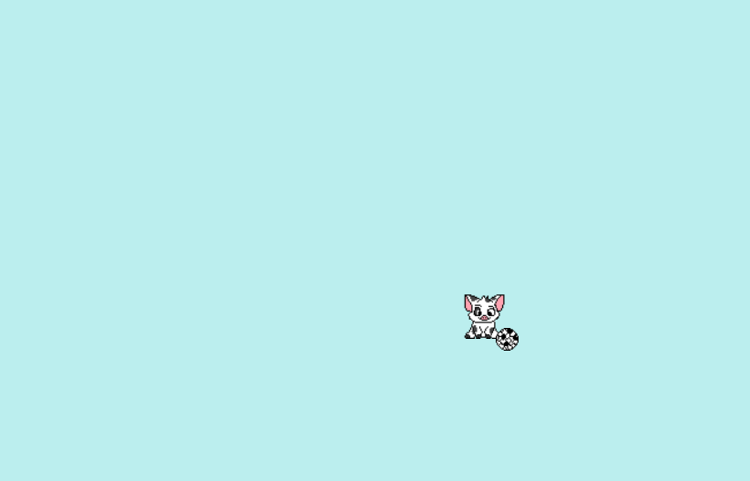

# Pua Chase

Inspired by [Neko](<https://en.wikipedia.org/wiki/Neko_(software)>).



It's Pua from Moana chasing a ball:

- With a mouse, the ball follows the mouse
- Without a mouse, drag and move the ball around

## Getting Started

To run it locally, you may use [`http.server`](https://docs.python.org/3/library/http.server.html) from Python 3

In the directory of the repository, run:

```bash
python3 -m http.server --directory $(pwd)
```
